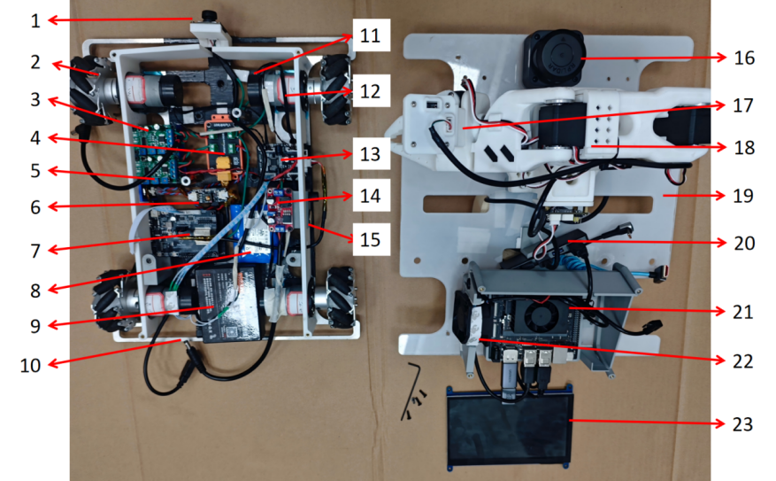
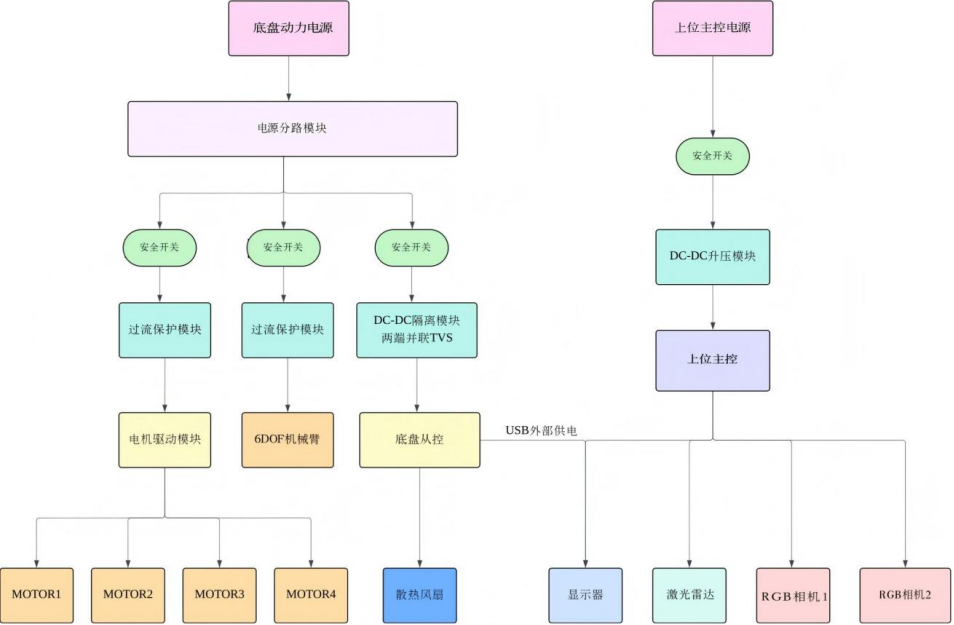
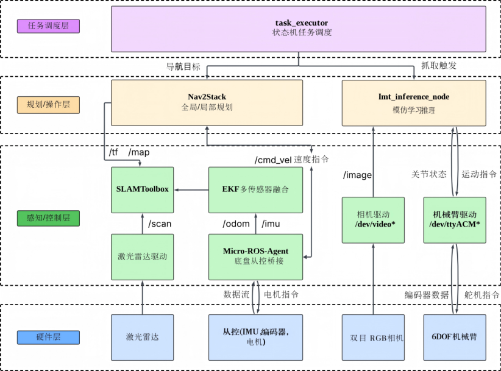

<video width="600" controls>
  <source src="videos/running.mp4" type="video/mp4">
</video>

本项目特点是一种带分层电源管理与双主控架构的全向移动操作机器人。
主要组成包括全向移动底盘、感知模块、双主控控制单元、主动散热模块、机械臂模块、分层电源管理模块和信号抗干扰模块；
- 全向移动底盘中包括下层承载板和通过对应直流减速电机独立驱动的若干移动轮，承载板位自主设计加工，电机为幻尔机器人的520AB相6路直流减速电机。
- 感知模块包括车体前方的2D激光雷达思岚C1M1、底盘前置RGB相机和手眼RGB相机；
- 双主控控制单元包括上位主控 Jetson Orin Nano Super 8GB 和 底盘从控 鱼香ROS的ESP32开发板，二者通过micro-ROS UDP4通信；
- 主动散热模块为一个直流风扇和风扇PWM控制单元；
- 机械臂模块使用6自由度小型机械臂SO-101，训练还需要一个同构从臂;
- 电源管理模块包括底盘动力电池和上位主控电池，两块锂电池规格分别为12v4500mAh/12v2800mAh。底盘动力电池为底盘电机、机械臂和底盘从控供电；上位主控电池经12v-19v升压模块为上位主控供电；本模块还包含主控隔离单元和过流保护单元的关键电气安全架构。主控隔离单元采用的是DC-DC隔离模块，过流保护装置为直流电机过流保护模块。
- 信号抗干扰模块主要对I2C总线数据和电机编码器数据进行保护，避免电机驱动电压的启停对信号的干扰。

本项目的机器人功能实现包括建图、导航、抓取和有限状态机任务编排；
- 建图功能订阅2D激光雷达扫描数据和底盘里程计数据，生成二维栅格地图；
- 导航功能用于加载静态地图并向底盘从控下发速度指令；
- 抓取功能用于接收底盘前置RGB相机图像、手眼RGB相机图像和机械臂关节状态，输出机械臂动作序列；
- 状态机用于协调各模块运行顺序；有限状态机包括空闲状态、导航至抓取点状态、抓取状态、返航状态、任务完成状态和任务失败状态。

本项目的一些软硬件设施及其对应的功能:
- 全向移动底盘具体包括下层承载板、四个麦克纳姆轮、四个带编码器的直流减速电机、电机驱动模块和底盘从控，四个麦克纳姆轮分别布置于下层承载板四角并由对应直流减速电机独立驱动。
- 上位主控为嵌入式计算平台，用于运行建图、定位、导航、任务编排和抓取推理程序，底盘从控用于执行麦克纳姆轮运动学解算、电机控制、编码器采集、里程计发布和风扇PWM输出。
- 因为I2C通信出现编码器数据跳变太严重，底盘从控烧录程序中还设置数据异常抑制结构，算法根据电机最大转速、编码器分辨率和采样周期确定单周期物理可达脉冲变化阈值；当前周期脉冲增量超过该阈值时，判定为异常跳变，丢弃该异常值并采用上一周期有效值或限幅后的值参与里程计计算。
- 主动散热模块就是一个由从控驱动的风扇，上位主控周期读取自身CPU温度和GPU温度，根据最高温度选择风扇PWM值发送至底盘从控，底盘从控根据所述风扇PWM值驱动散热风扇；在未接收到有效风扇PWM值或通信超时时，按照预设PWM值驱动散热风扇。
- 主控隔离单元包括DC-DC隔离模块和TVS瞬态电压抑制器件；DC-DC隔离模块设置于主控相关供电支路，用于将主控电路与感性负载所在母线电气隔离；瞬态电压抑制器件并联设置于隔离模块输入端或输出端，用于对电机换向、开关动作和堵转产生的尖峰电压进行钳位；
- 过流保护单元包括底盘动力支路过流保护模块和机械臂支路过流保护模块；底盘动力支路过流保护模块串联于底盘动力支路，在底盘被障碍物卡住、电机堵转或电机驱动支路电流超过阈值时切断该支路；机械臂支路过流保护模块串联于机械臂支路，在机械臂过载、舵机堵转或线路短路时切断该支路；安全开关设置于供电输入端或关键支路前端。

本项目可能的意义：
- 整机机械结构在保障结构稳定性前提下广泛采用3D打印件，有利于个人自主制造和快速迭代，降低制造成本；
- 对于电气系统设计了分层供电、DC隔离和过流保护等模块，有利于保护各个支路的电子设备，方便更换维护，避免因某一支路故障导致其他电子设备的损坏；
- 使用双主控架构和micro-ROS UDP4通信，让上位机和底盘可以实现物理解耦，能够在底盘算法开发和二次开发时无需安装底盘到上位机的线束，方便系统测试。

本项目的机器人成品图以及拆开视角:
1、成品图

2、拆开视角

1. 底盘前置RGB相机；2. 麦克纳姆轮；3. 过流保护模块1；
2. 电源分路模块；5. 过流保护模块2；6. 主控隔离单元；
3. ESP32开发板；8. 上位主控电池；9. 底盘动力电池；
4.  下层承载板；11. 编码器；12. 直流减速电机；
5.  电机驱动模块；14. 直流升压模块；15. 安全开关；
6.  2D激光雷达；17. 手眼RGB相机；18. 6自由度机械臂；
7.  上层承载板；20. USB集线器；21. 上位主机；22. 散热风扇；23. 显示屏

本项目的电气架构:

本项目的软件框架:

BOM表:
| 序号 | 名称 | 型号 | 数量 | 备注 |
| :--- | :--- | :--- | :--- | :--- |
| 1 | 机械臂 | SO-101 | 1 | 需要主从臂 |
| 2 | 激光雷达 | 思岚 C1 | 1 |  |
| 3 | 主供电电池 | E345S-12v-4500mAh | 1 |  |
| 4 | 上位机电池 | 辰克-12v-2800mAh | 1 |  |
| 5 | 驱动电机 | JBG37-520R90-12 | 4 |  |
| 6 | 麦克纳姆轮 | Wheeltec | 4 | 购买有固定底座的 |
| 7 | 抱紧式联轴器 | Wheeltec | 4 |  |
| 8 | 电机驱动模块 | 幻尔四路编码器电机驱动模块 | 1 |  |
| 9 | 底盘 ESP32 主控 | 鱼香ros ESP32-WROOM 开发板 | 1 |  |
| 10 | 整机 Jetson 主控 | Jetson Orin Nano Super 8GB | 1 |  |
| 11 | 直流电机过载保护模块 | 晒邦电机控制 | 2 |  |
| 12 | DC-DC 隔离模块 | 直流隔离模块 | 1 |  |
| 13 | 防电流反灌模块 | - | 1 | 用来实现esp32板子给usb hub单向供电 |
| 14 | TVS | SMBJ15A | 2 |  |
| 15 | 显示屏 | 亚博智能-7 英寸 | 1 |  |
| 16 | 散热风扇 | AVC6038-12v-1.65A | 1 |  |
| 17 | USBhub | 绿联—支持外接供电 | 1 |  |
| 18 | RGB 相机 | - | 2 |  |
| 19 | DC-DC 升压模块 | XL6019 | 1 |  |
| 20 | 螺纹紧固件若干 | - | 1 |  |
| 21 | 编码器 6 路排线若干 | - | 4 |  |
| 22 | USB-typeC 线若干 | - | 1 |  |
| 23 | 安全开关若干 | - | 4 |  |
| 24 | 主体车身底板 | 激光切割 | 1 |  |
| 25 | 车身连接件若干 | 3D 打印 | 1 |  

mcnm_robot_code文件夹里面放置了本项目所有的机器人模型文件和任务启动文件，
其中mcnm_robot_ws下面是机器人的ROS2工作空间，包含了在ROS2 Humble下面定义的各个功能包;
mcnm_robot_control下面是机器人的底盘esp32烧录程序;
micros_ws和lidar_ws下面是micro-ROS Agent和RPLIDAR激光雷达的ROS2工作空间，均可直接按照对应的readme介绍从github上拉取源码。

备注:
SO-101机械臂可淘宝购买或参考官方文档https://huggingface.co/docs/lerobot/so101自主复现